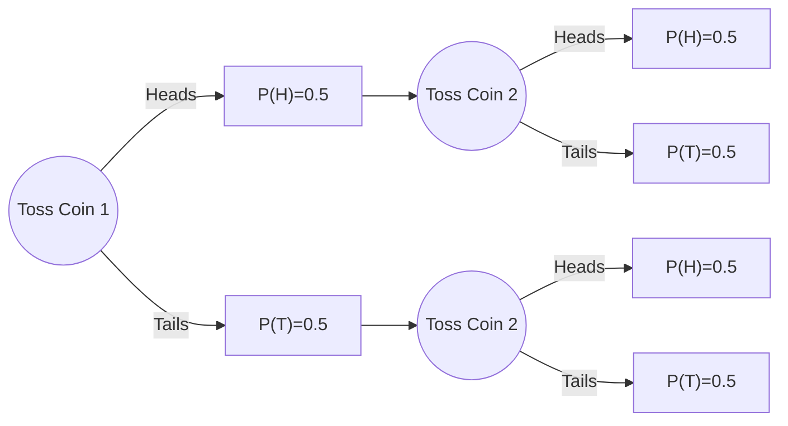
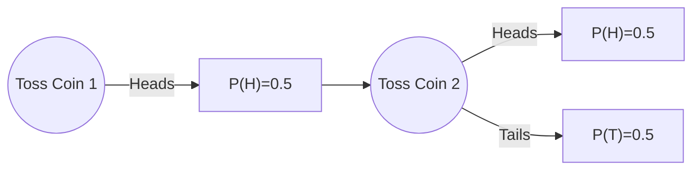

---

title: Conditional Probability

tags: Probability

key: 20231115100118571717

  

---

Conditional probability is measure of calculating the probability of an event happening given that another event is happening.

In general it is denoted as $P(A|B)$, which emphasizes the dependence of the probability of $A$ on the occurrence of $B$.

Based on the formula, derived from the definition of probability:
$$
P(A|B)=\frac{P(A\cap B)}{P(B)}
$$

> [!tip]
> Here numerator reprents the probability that both events $A$ and $B$ occur simultaneously while denominator represnts the probability of the condtioning event B occuring.

If the occurrence of $B$ has an impact on the probability of $A$, then $A$ and $B$ are dependent events, On the other hand, if the occurrence of $B$ has does not affect the probability of $A$, then they are called independent events.

Let's assume that i toss a coin twice to get two heads, Our general approach to find the probability this case would be to multiply the probability of each events. (Since they are independent events)

|                                     | $2^{\text{st}} \text{ coin (Head)}$ | $2^{\text{st}} \text{ coin (Tail)}$ |
| ----------------------------------- | ----------------------------------- | ----------------------------------- |
| $1^{\text{st}} \text{ coin (Head)}$ | Head, Head                          | Head, Tail                          |
| $1^{\text{st}} \text{ coin (Tail)}$ | Tail, Head                          | Tail, Tail                          |

Therefore probability for $P(H)$ on the first toss is $0.5$ and $0.5$ on the second toss.
$$
\begin{align}
& P(HH)=P(H)\times P(H) \\ \\
& P(HH) = 0.5 \times 0.5 \\ \\
& P(HH) = 0.25
\end{align}
$$
But what if we want to add a special case, an exception, In such cases we use conditional probability. It's like what is the probability of landing on hearts twice ==given that first one is hearts==.

|                                     | $2^{\text{st}} \text{ coin (Head)}$ | $2^{\text{st}} \text{ coin (Tail)}$ |
| ----------------------------------- | ----------------------------------- | ----------------------------------- |
| $1^{\text{st}} \text{ coin (Head)}$ | Head, Head                          | Head, Tail                          |

This could be formulated in the following way,

$$
\begin{align}
& \text{Sample Space}=2  (\{H,H\})\\ \\
& \text{Event }= 4 (\{(H,H),(H,T)\}) \\ \\

&  P(H \cap H) = 0.25 \\ \\
& P(H) = 0.5 \\ \\
& P(HH|\text{1st is H}) = \frac{2}{4} \text{  or } \frac{0.25}{0.5}
\end{align}
$$

